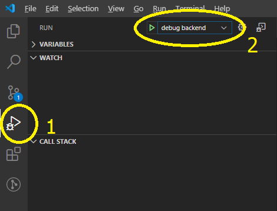
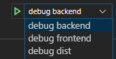

# fusebox backend(node)/frontend sample

A fork from https://github.com/vegarringdal/fusebox-front-and-backend

## Features
* One minute installation
* Minimal dependencies
* Automatic refresh when the code changes
* Debugging in vscode of both backend and frontend

## Quick start
### Installation
Get the code. Either download it from github or in a console type. 
```
git clone https://github.com/vegarringdal/fusebox-front-and-backend.git myapp
cd myapp
npm install
```

### Start the development server
```
npm run start
```
Then open this page your favorite browser http://localhost/


## debug the backend

start vscode
```
 code
```
Then select the run Run tab `Ctrl+shift+D`. There you can select the debugging target and start it (or `F5`)



## debug the frontend

To debug the frontend, from visual studio code, you need to install the extension : Debugger for Chrome `msjsdiag.debugger-for-chrome`.




